# Retro Handheld Setup Primer

### Introduction

So you want to setup your shiny Retroid Pocket device, or another Android handheld device? This guide will help you with getting your started. This guide will serve to give you the basic information before you dive deeper into other guides available online. I created this guide to help those are new to the retro handheld community, and hope this helps you with getting started. This guide in particular targets the Retroid Pocket 4/pro, 5 and Mini models. But it very well scales up to the likes of the Ayn Odin 2. I made it this way so that you can get an idea of the floor settings and can bump up graphics settings from there.

<!-- more -->

If you want to support me, you can do so via the following:

<a href="https://www.buymeacoffee.com/ojaysan" target="_blank"></a>

<a href='https://ko-fi.com/A3733GWR' target='_blank'></a>

## Before you get your Handheld

Use this section to start getting these items as you wait for your device to come in and read this guide to set up your device. Keep in mind since this is an Android device at its core, you will be able to simply use the device itself to configure everything from there without a PC. But for sourcing ROMs, having a PC is very handy.

### Hardware

I highly suggest to get a good card that's large. Buy once, cry once as they say. You can load up all the stuff you'll ever need to set up your device.  You will probably be using ~50GB or so for just artwork but it really depends on how many games you have to store. ES-DE will fetch video, photos of the game and there isn't really a way to configure this. 

| MicroSD | Size  | Specs     | Price                  | Notes                                         | Links |
| ------- | ----- | --------- | ---------------------- | --------------------------------------------- |-------|
| Samsung | 512GB | V30 ideal | Usually cheaper        | Has different offerings and levels of quality | [Amazon](https://amzn.to/4gAb6af) |
| Sandisk | 512GB | V30 ideal | Usually more expensive | Has fewer offerings of quality levels         | [Amazon](https://amzn.to/40jAUBq) |

### Apps & Software

The items in Utilities are optional but help make the experience nicer. In this guide we are using ES-DE as our game launcher but it is optional. Retroid for example has their own game launcher but this guide is not currently focused on using that application.

#### Free
##### Utilities
| App            | Description                                                                                                                                                                                                                                                                                              |
| -------------- | -------------------------------------------------------------------------------------------------------------------------------------------------------------------------------------------------------------------------------------------------------------------------------------------------------- |
| [Obtainium](https://github.com/ImranR98/Obtainium/releases)      | to keep track of apps not on the playstore                                                                                                                                                                                                                                                               |
| [Odin Tools](https://github.com/langerhans/OdinTools/releases)     | to control fan settings when opening specific apps                                                                                                                                                                                                                                                       |
| [Syncthing](https://play.google.com/store/apps/details?id=com.github.catfriend1.syncthingandroid&hl=en_US)      | to sync your files for multiple devices                                                                                                                                                                                                                                                                  |
| [Zarchiver](https://play.google.com/store/apps/details?id=ru.zdevs.zarchiver&hl=en_US)      | to handle unzips                                                                                                                                                                                                                                                                                         |
| [Rufus](https://rufus.ie/)          | for flashing and setting up ext4                                                                                                                                                                                                                                                                         |
| [UniPatcher](https://github.com/btimofeev/UniPatcher/releases) | for adding patches to apps |
| Google Account | for android ecosystem. Create a Google account if you already don't have one. You'll want this for setting up your handheld. You can get away without this, but you won't have access to the play store to grab the above apps. If you're advanced, you can use F-Droid or Aurora store so get the apps. |


#### Paid

##### Frontend

- [Emulation Station](https://www.es-de.org) (ES-DE) - The frontend you'll be setting up. It is paid, but very much worth using. Refer to their site to purchase and download the app. It's a one time deal but be sure to follow their instructions to cancel so you don't get charged monthly (unless you want to)!
	-  Screenscraper - This site is where you'll be getting your artwork for your games. Create an account (its free) and save your account info for later.

#### Core

##### Emulation

| System          | Emulator              |
| --------------- | --------------------- |
| 3DS             | Citra                 |
| DS              | [Drastic](https://play.google.com/store/apps/details?id=com.dsemu.drastic&hl=en-US)               |
| GameCube        | [Dolphin](https://dolphin-emu.org/)               |
| GameBoy         | [Retroarch](https://www.retroarch.com/)              |
| GameBoy Color   | [Retroarch](https://www.retroarch.com/)              |
| GameBoy Advance | [Retroarch](https://www.retroarch.com/)              |
| PS1             | [Retroarch](https://www.retroarch.com/)              |
| PS2             | [Aethersx2 / Nethersx2](https://github.com/Trixarian/NetherSX2-patch/releases) |
| Switch          | Yuzu                  |
| Wii             | [Dolphin](https://dolphin-emu.org/)               |

### Configure your microSD Card

Once you have all the apps above available, go ahead and format your card on your PC/laptop/etc. You will want to use the ExFAT format.

You have two options:

1. If you already have an android device with microSD card support. Use the device to format in portable mode, this allows you to move the card around and you can transfer from your PC directly. You might be able to get a USB to sdcard dongle but I've never really tested that method. YMMV.
2. Use Rufus on PC to format the microSD card. This may work, but is untested and generally would suggest to use the handheld to format it or an android device.

It's going to pay off to be organized so here's an example of how I set up my sdcard with a file structure like the following:

```
.
|─ .ROMS/
|	(ES-DE will populate the different system folders)
|─ 	|─ gb
|	|─ gba
|	|─ gbc
|	|─ switch
|	|─ n3ds
|	|─ gc
|	|_ ps2
|─ ./deviceSetup
|	|─ apks
|	|─ dlc
|	|─ bios
|	|─ drastic
|	|─ retroarch
|	|_ nethersx2
|─ .ES-DE/
```

Create the various folders like so and that's all you'll really need to get started. In the deviceSetup folder, you'll see three subfolders you need to make. 

- Apks for the apps you downloaded
- dlc's for any files such as switch files that you may want to keep separate, for example. I find that it gets messy if you put all your dlc/patch switch files in the same directory as in the ROMS folder. 
- Bios are for well, bios files. Some systems like PS1, PS2, switch will require these types of files.
- ES-DE folder to store the configurations for the application. You'll point to this directory when you start up the app for the first time.

!!! note

	The aformentioned of game files, etc will have to be done own your own. I cannot help you with this. Refer to online search engines for this part.

## Putting it Together

Alright, so you've been waiting weeks (or months!) for your handheld and you see you got the tracking update for delivery, *today*. Make sure you have everything above before you continue.

### Android and Game System Setup

If you've never used an Android phone, don't worry, the set up is pretty similar to setting up an iphone or iPad, etc. Power on the device and set up your Google account. Go through the prompts and eventually you will land onto the home screen. Go ahead and start installing all of the apks. We'll go through each app below next.

First things first, you would want to decide where you want to place these configuration files. Do you want to have them in the internal memory, or in your microSD card? This is important so thinking about this. I highly suggest to put as many files to your card so you can move configurations around.

#### Android Settings

Turn off the lock screen to use no lock via the system settings under settings->lock screen and select none

#### RetroArch

This is probably the least favorite app to set up. But it contains most of the older systems so its great in that way. The UI and navigation is a bit weird at first if you're not familar with computers but it works more or less like a terminal in terms of how the navigation works. 

##### Set the Theme

The first thing you'll want to change is the theme because it might be hard for you to find things. Go to **User Interface**->**Menu** and select **XMB** . Restart the app by exiting from the top level.

When you open the app back up, you'll be greeted with a Playstation like theme. I do find its easier for new people and its nicer for larger displays.

##### Set Your Configuration Directory

<div class="grid" markdown>

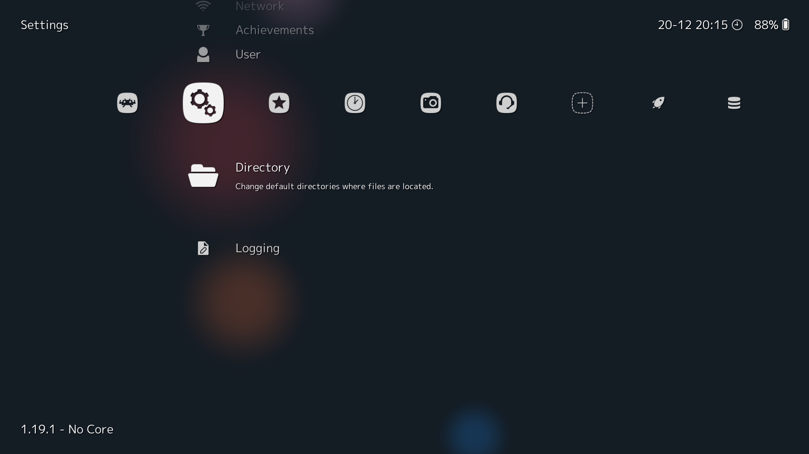{ loading=lazy }

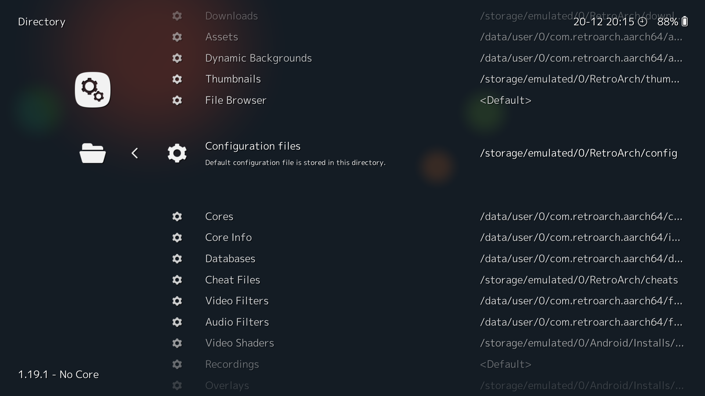{ loading=lazy }

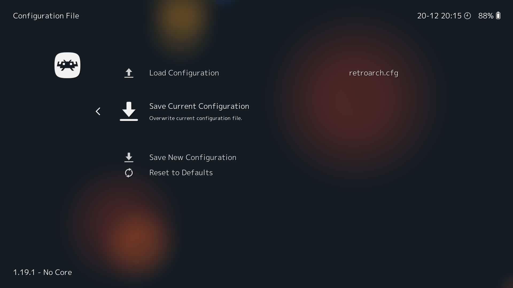{ loading=lazy }

</div>

Remember when I mentioned about having your configuration saved in your sd card? Well, you can do that in RetroArch. Find the **Cog Icon**->**Directory** from there you can select wherever you'd like to store the various files. I think at the minimum I would configure the configuration file and core. That way, you won't need to redownload these next time and just use this same setup to repoint them on a different device.

The first thing you will want to do is enable **Save Configuration on Quit** as this saved me so many times when I change a setting and forget to save it. Yes, Retroarch does not save upon the change. After this, go back to the main section and find the cog section and select **Save Current Configuration**.

<div class="grid" markdown>

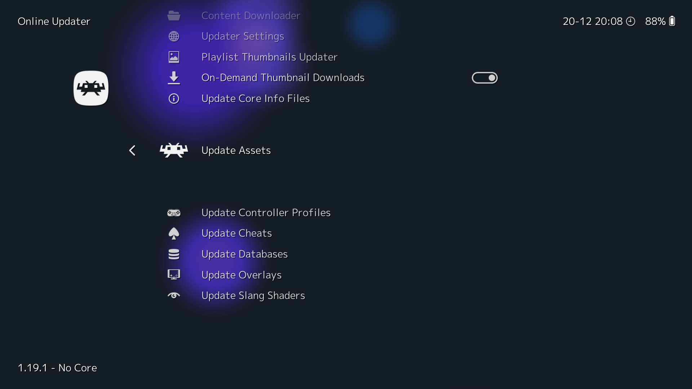{ loading=lazy }

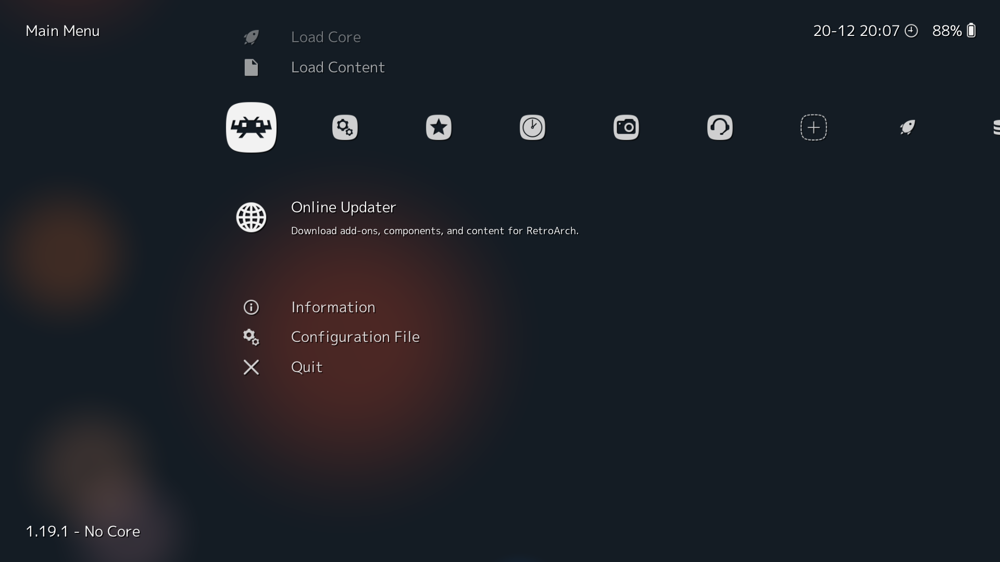{ loading=lazy }

</div>

##### Update from the Database

Next is to update the app with the online database. Select the **Online Updater** at the first menu you see. Scroll down to it.

Once selected, update the following:

- Assets
- Cheats
- Databases
- Overlays
- Slang Shaders

##### Game Cores

<div class="grid" markdown>

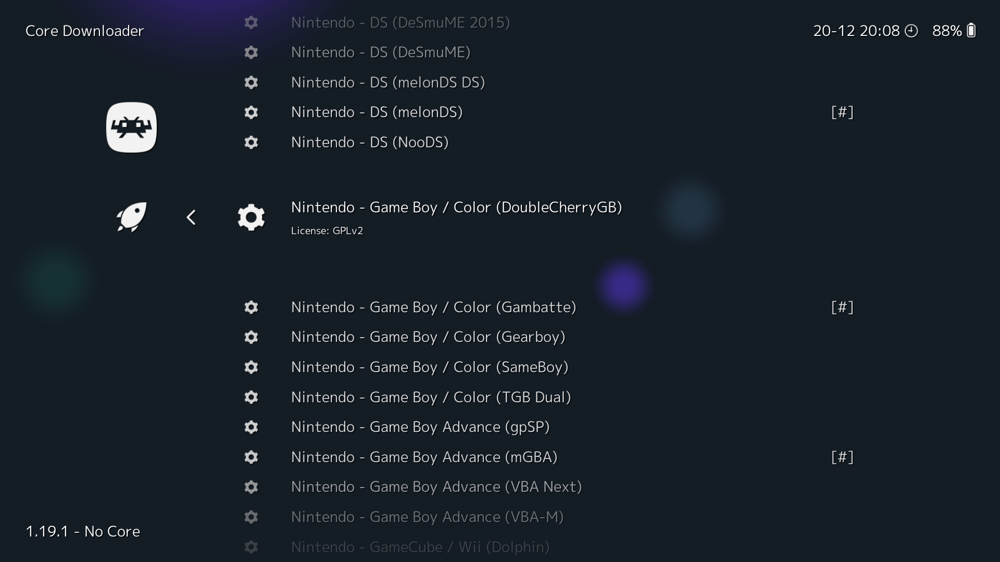{ loading=lazy }

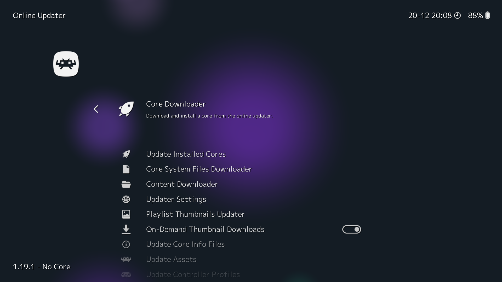{ loading=lazy }

</div>

Afterwards, now you need to grab the cores for each system you want to play. For example, we will set up PS1, GameBoy, GameBoy Color, GameBoy Advanced. If you want other cores you can simply grab them from within RetroArch if they are available.

##### Shaders and Filters

Check back later.

##### Device Input Setup

<div class="grid" markdown>

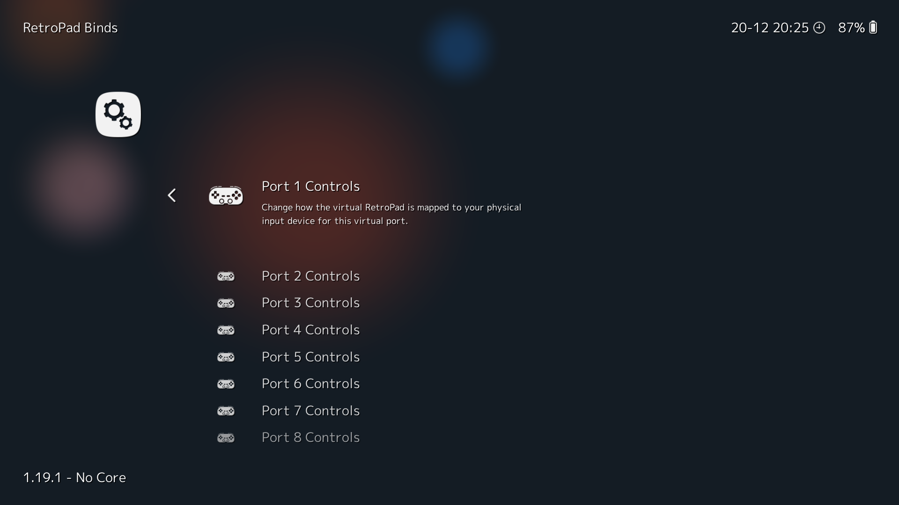{ loading=lazy }

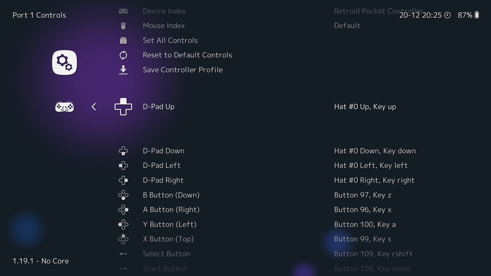{ loading=lazy }

</div>

This is where you'll want to start binding your handheld's inputs. Go to the **Cog Icon**->**Input**->**RetroPad Binds**->**Port 1 Controls**. From here you should see something referring to a Device Index. Make sure its populated with something. In the case of Retroid devices like the Retroid Pocket 5, mini and 4, it will say something like Retroid Pocket Controller. Afterwards, now go ahead and for each entry select the input you want to map to. This part is very straightforward as when you select an entry, you'll be given a few seconds to select the input you want or else it will not bind anything for any respectively entry.

##### Hotkey Setup

We'll set up the basics here. In the same subfolder as in the Device Input Setup, find the **Hotkeys** section. 

- Hotkey Enable: Select or L3
- Menu Toggle: top face button (either x or y if you're in switch or xbox layout)
- Quit: Start

You can set up the others like fast forward for example to a trigger button, or saving to a savestate. I've just noted the ones you'll be using most often to get in and out.

At this point you're more or less ready to access the retroarch menu while in a game.

#### Drastic

##### Configuration

Similar to retroarch, you're allowed to select where all of the data files for the app live. And again, I select my sdcard. When you setup your card earlier you should have made the folder we're going to select (drastic). Exit the app and reopen to apply the change.

##### Device Input Setup

Locate the input settings and similarly map the buttons to the respective locations.

##### Hotkeys

You can set these up but on these Android handhelds the back button works really well to bring up the menu. So I don't set up anything here.

#### Nethersx2

##### Configuration

You'll need to get aethersx2 3668 online and then use an app called UniPatcher to decompile and add in the patches for the APK. This converts it to "Nethersx2", which you'll want to grab the patch files from [Github](https://github.com/Trixarian/NetherSX2-classic/releases). 

Once finished, install the app and then start up. The prompt will need to select your BIOS otherwise you won't be able to boot. I suggest to put the save files in your SD card as well. We created that nethersx2 folder earlier so you can put it there by selecting the directory within the application. 

###### Graphics Settings

This is where I will list out various settings for the different android handhelds to set to.

| Render | Upscale   | Others                        |
| ------ | --------- | ----------------------------- |
| Vulkan | 3x Native | Enable Widescreen patches: On |

##### Device Input Setup

Similar to other emulators discussed earlier, the inputs by mapping each button to the respective entries. The main thing here is to go into controller settings and then "Touchscreen" tab. Here find the "Hide With External Controller" and make sure the toggle is on. This will hide the input control overlay. Next, go to the "Controller Port 1". You can try the automatic mapping but I find that it doesn't work for all android handhelds. Otherwise, go ahead and assign the respective keys to each entry.

##### Hotkeys

Hotkeys aren't needed as the back button works well.

#### Dolphin

<div class="grid" markdown>

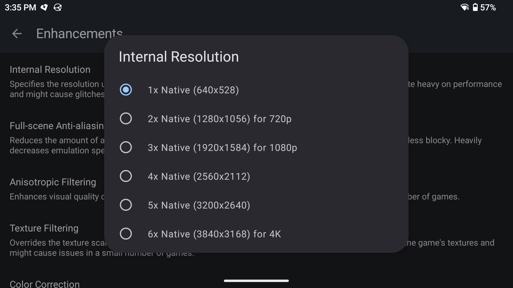{ loading=lazy }

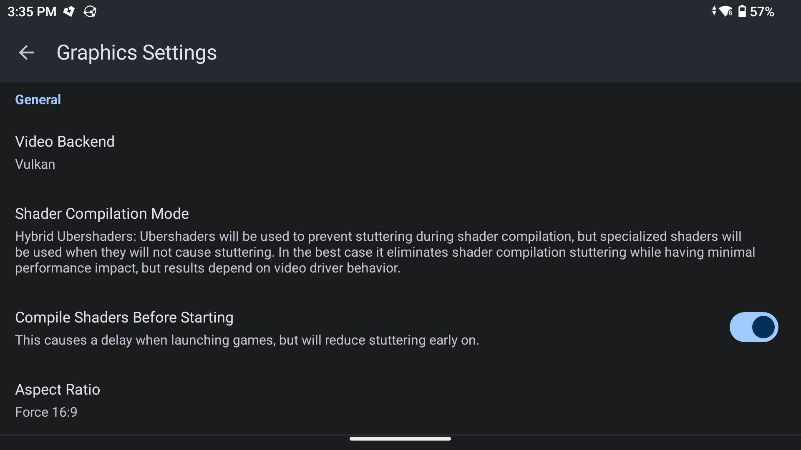{ loading=lazy }

</div>

##### Configuration

The next few systems are similar since they're made by overlapping team members. Dolphin has both gamecube and wii systems.
###### Graphics Settings
This is where I will list out various settings for the different android handhelds to set to. For something like Retroid Pocket Mini, use auto or 4:3 aspect ratio.

| Render | Upscale   | Shader Comp Mode   | Compile Shaders Before Starting | Aspect Ratio |
| ------ | --------- | ------------------ | ------------------------------- | ------------ |
| Vulkan | 3x Native | Hybrid Ubershaders | On                              | Force 16:9   |

##### Device Input Setup

Input setup is probably the most complicated here due the wii's unique input

###### GC

<div class="grid" markdown>

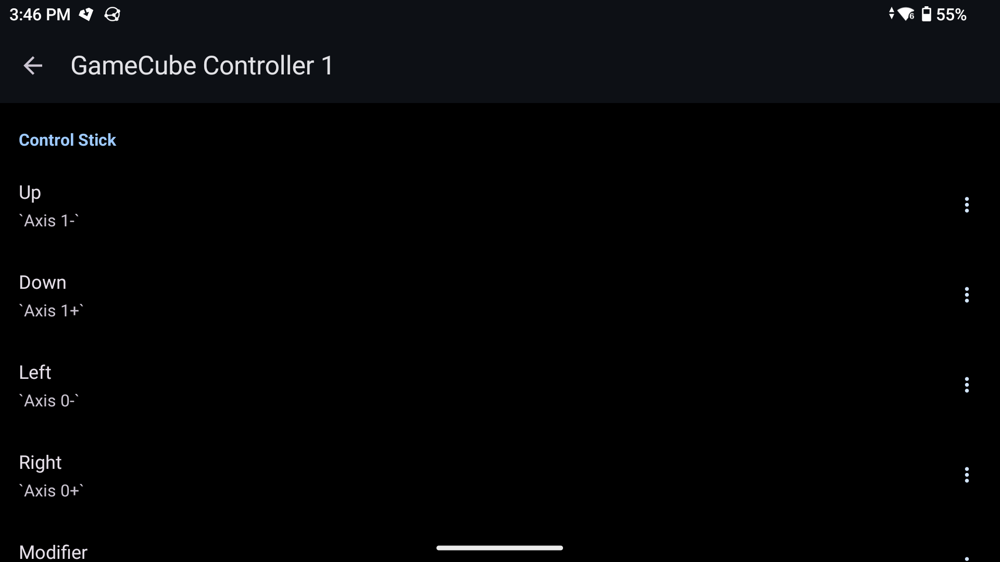{ loading=lazy }

</div>

Here's what I use. Keep in mind this is referencing  the stock Retroid layout which uses switch style.

###### Buttons

| App | Controller |
| --- | ---------- |
| A   | B          |
| B   | Y          |
| X   | A          |
| Y   | X          |
| Z   | R1         |

###### Control Stick

| App | Controller                |
| --- | ------------------------- |
| CS  | Use **Left** analog stick |

###### C Stick

| App | Controller                 |
| --- | -------------------------- |
| CS  | Use **Right** analog stick |

###### Triggers

| App | Controller           |
| --- | -------------------- |
| L/R | L/R triggers (L2/R2) |

###### Wii

This section will only cover the basics to get started. There's a lot for Wii and this page will be updated to cover other profiles soon.

Wii Remote 1 select "Emulated Wii Remote", then select the cog button.

| Extension | Buttons   |
| --------- | --------- |
| Nunchuk   | See below |

| App | Controller |
| --- | ---------- |
| A   | B          |
| B   | Y          |
| 1   | X          |
| 2   | A          |
| -   | Select     |
| +   | Start      |

###### D-pad
Set as normal

###### Motion Sensing

The following is for the motion sensing portion. This will allow you to use software to point while holding down L3/R3.

| App             | Controller |
| --------------- | ---------- |
| Sideways toggle | L3         |
| Upright toggle  | R3         |

!!! Note
	This is purely preference, you can set this however you like, but this is the easiest from what I have tried.

#### Citra

##### Configuration

Configuring Citra is straightforward compared to the previous systems.

###### Graphics Settings

| Render   | Upscale   | Others                                                                            |
| -------- | --------- | --------------------------------------------------------------------------------- |
| OpenGLES | 4x Native | Enable SPIR-V shader generation: On<br>Enable Asynchronous shader compilation: On |

##### Device Input Setup

Similar to other emulators discussed earlier, the inputs by mapping each button to the respective entries. The main thing here is to go into controller settings and then "Touchscreen" tab. Here find the "Hide With External Controller" and make sure the toggle is on. This will hide the input control overlay. Next, go to the "Controller Port 1". You can try the automatic mapping but I find that it doesn't work for all android handhelds. Otherwise, go ahead and assign the respective keys to each entry. If you're using a switch style layout, its pretty straightforward.

#### Yuzu

##### Configuration

Unfortunately Yuzu and other similar emulators may require configurations per game but I will try to outline the general things that you may need to change. There is a per game setting so once you set that up you won't have to change it. For example, the driver and audio settings may need to set on a per game basis. But you can set the global default and then tweak on each game that does not work with said settings. To modify a game's setting, tap and hold the respective game and then you'll be in the sub menu for it.

###### Starting Up

When you launch the app for the first time, you'll need to provide the prod keys and then the ROM location. Use the information previously to provide this info to the application.

###### DLC / Mods / Addon Content

So there are ways to combine game files to contain all of the patches and DLC but you can simply go to each games's  submenu and then add the DLC/patch content

###### Graphics Settings

| Render | Upscale   | Docked Mode | Audio          | GPU driver manager                 |
| ------ | --------- | ----------- | -------------- | ---------------------------------- |
| N/A    | 1x Native | Preference  | Per game basis | vulkan 1.3.296 Mesa driver Rev 9v2 |

##### Device Input Setup

See the citra setup, its the same changes here.


## Advanced Topics

### Syncthing

will be filled out later

## Complete the Look

From this part on, these are optional things but really complete the experience. Once you have this set up once, you can take this set up to whichever android device!

### Emulation Station Frontend Setup

So you've gotten your games set up now and so its time to link the frontend to launch these games. [Emulation Station](https://www.es-de.org) by default will attempt to search for the various emulators available. If you need to add a custom setup, I suggest referring to the documentation from the ES-DE page. Note that you need to look for the Android specific version, not the linux version.

#### Configure Basic Settings

First thing is to turn off the virtual overlay. Press start and select **Input Device Settings** and then disable **Enable Touch Overlay**. By this point, your games should have be scanned by ES-DE and you should be able to see them in the various categories. Go ahead and try to launch a game from each system you plan to use. If things are launching correctly, then you can move on. If not, check **Other Settings->Alternative Emulators**. This is what I was rerferring to if you installed a different emulator that ES-DE does not natively look for. However, the emulators we're talking about here in this guide should be available.

#### Adding Artwork

Now we'll want to obtain the artwork for our games. Head to the **Scraper** section and then select **screeenscraper** as the site to use. I would suggest to plug in your device and leave it on to download the files. There is a rate limit on the site so I would also suggest to do one system at a time. Also keep in mind that the media downloaded stores itself within the ROMs folder under the respective system directory called **downloaded_images** and **downloaded_videos**.

#### Themes

Themes are plenty in ES-DE. All you need to do is select **UI Settings** and then download the theme of your choice. Different themes have different options so be sure to play around with what you like!

## Final Thoughts

If you've made it through this guide, you now have all the tools needed to set up and configure your Android device! I hope this has been helpful and as a living document, I plan to update it as time goes on to cover more topics in the future. Credit is due to all of the creators referred to in this guide and their applications.

If you want to support me, you can do so via the following:

<a href="https://www.buymeacoffee.com/ojaysan" target="_blank"></a>

<a href='https://ko-fi.com/A3733GWR' target='_blank'></a>